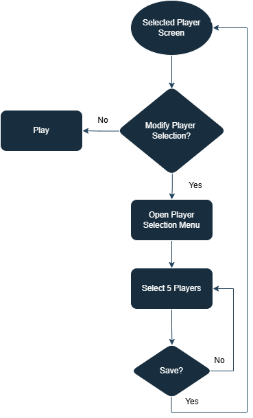

# Player Selection System
 
The Player Selection System is designed to allow the user to select up to 5 players from a list of available players, view the selected players on another screen, and save or modify their selection. It uses a combination of Unity's Scriptable Objects, MVC architecture, and UI components to create a flexible and modular system.

# User Flow

# Architecture
MVC 
This project follows the Model-View-Controller (MVC) architecture pattern to separate concerns and make the codebase more modular and maintainable.

Model: The PlayerDataScriptableObject holds player data, including image, name, attributes, and experience.
View: The PlayerRowUI and PlayerSlotManager classes are responsible for rendering player data on the screen.
Controller: The PlayerListManager and PlayerSlotManager manage the player data and handle user interactions like selecting and saving players.
